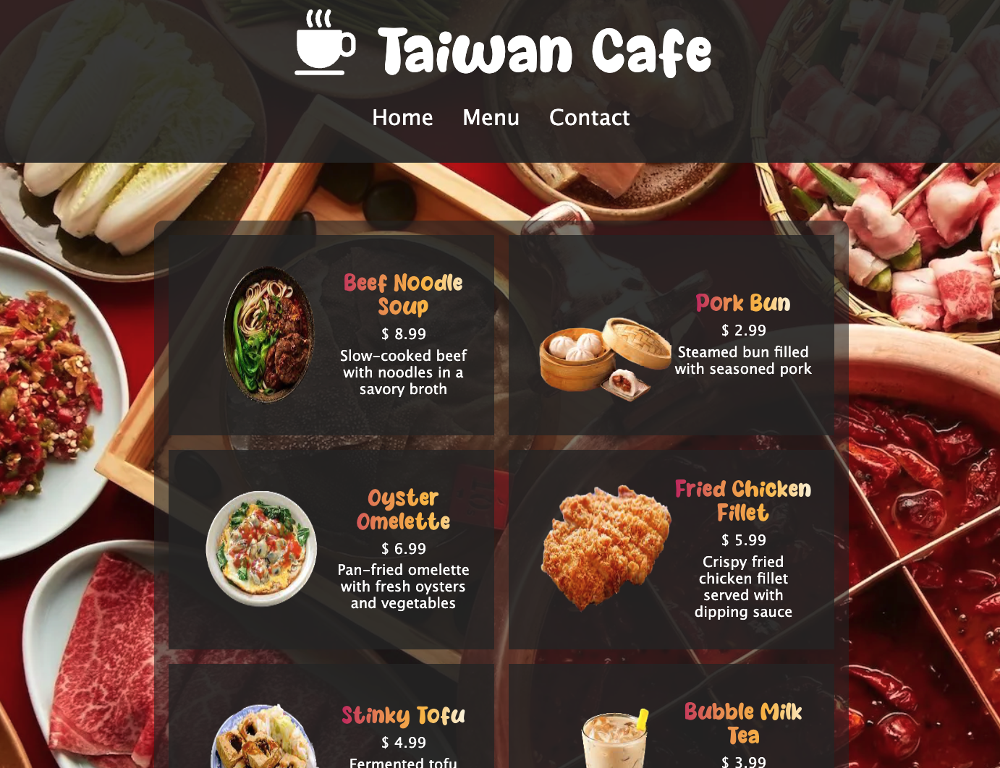

# Restaurant Page
This is a simple restaurant homepage! Contents are dynamically generated entirely by JavaScript.

## Table of Contents
- Demo
- Technologies Used
- Features
- Credits
## Demo
Check out the [**live**](https://elsiechen.github.io/Restaurant-Page/) demo.

## Technologies Used
- HTML
- CSS
- JavaScript
- Webpack
- ES6 Modules
- Prettier

## Features
- Use webpack to organize and bundle modules including dependencies, image and font assets into optimized files  
that can be efficiently loaded by web browsers.
- Use ES6 Modules to organize code into separate files to make it easier to maintain and reuse code within project.
- Use Prettier package to format the output index.html file that webpack left all tags in one line which lose code readability.

## Credits
- The Odin Project:[Project: Restaurant Page](https://www.theodinproject.com/lessons/node-path-javascript-restaurant-page)

- Hot pot picture:[vogue taiwan](https://www.vogue.com.tw/lifestyle/article/%E5%8F%B0%E4%B8%AD-%E9%BA%BB%E8%BE%A345)

- Suitcase picture:[pngtree](https://pngtree.com/freepng/hand-painted-taiwanese-brain--micro-world-travel-box_4104075.html)
